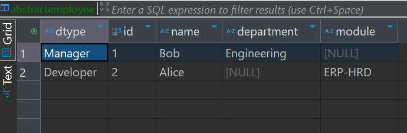
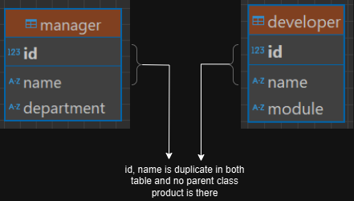
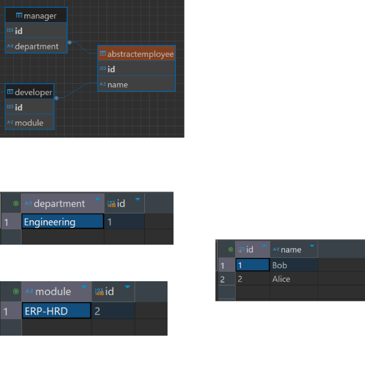

# Hibernate Inheritance Strategies

Hibernate provides several **inheritance strategies** to map object-oriented inheritance structures to relational databases.

## 1. Single Table Strategy (`SINGLE_TABLE`)
- Uses a **single table** for all classes in the hierarchy.
- Discriminates between subclasses using a **discriminator column**.
- Efficient but can lead to sparse columns when subclasses have many unique fields.

### Example:
```java
@Entity
@Inheritance(strategy = InheritanceType.SINGLE_TABLE)
@DiscriminatorColumn(name = "dtype", discriminatorType = DiscriminatorType.STRING)
public class Employee {
    @Id
    private Long id;
    private String name;
}

@Entity
public class Manager extends Employee {
    private String department;
}

@Entity
public class Developer extends Employee {
    private String programmingLanguage;
}
```

### Pros & Cons:
✅ Fast queries (single table access)  
✅ Simple to implement  
❌ Null values for non-shared fields  
❌ Less normalization

### Sample Table:

---

## 2. Table Per Class Strategy (`TABLE_PER_CLASS`)
- Each subclass has its **own table**, including all superclass fields.
- No table for the parent entity.
- Requires `@Id` in each subclass.

### Example:
```java
@Entity
@Inheritance(strategy = InheritanceType.TABLE_PER_CLASS)
public class Employee {
    @Id
    @GeneratedValue(strategy = GenerationType.AUTO)
    private Long id;
    private String name;
}

@Entity
public class Manager extends Employee {
    private String department;
}

@Entity
public class Developer extends Employee {
    private String module;
}
```

### Pros & Cons:
✅ No null columns  
✅ Better data integrity  
❌ Redundant data (superclass fields duplicated)  
❌ Queries require `UNION` operations

### Sample DB:


---

## 3. Joined Strategy (`JOINED`)
- Uses a **separate table for each class**.
- Common fields are stored in the **superclass table**.
- Uses `JOIN` queries when retrieving subclass data.

### Example:
```java
@Entity
@Inheritance(strategy = InheritanceType.JOINED)
public class Employee {
    @Id
    private Long id;
    private String name;
}

@Entity
public class Manager extends Employee {
    private String department;
}

@Entity
public class Developer extends Employee {
    private String module;
}
```

### Pros & Cons:
✅ Normalized structure  
✅ No redundant data  
❌ Slower queries due to `JOIN` operations  
❌ More complex queries

### Sample DB:


---

## 4. Mapped Superclass (`@MappedSuperclass`)
- **No table for the superclass**.
- Superclass fields are inherited by subclasses but **not treated as an entity**.
- Used for **code reuse**.

### Example:
```java
@MappedSuperclass
public abstract class Employee {
    @Id
    @GeneratedValue(strategy = GenerationType.IDENTITY)
    private Long id;
    private String name;
}

@Entity
public class Manager extends Employee {
    private String department;
}

@Entity
public class Developer extends Employee {
    private String module;
}
```

### Pros & Cons:
✅ No extra superclass table  
✅ Avoids unnecessary inheritance in DB  
❌ Cannot be queried as an entity (```sql: select p from Product p```) not possible.
❌ Less flexibility

[-- Sample DB structure is same as table_per_class
](#2-table-per-class-strategy-table_per_class)
---

## Choosing the Right Strategy

| Strategy         | Performance | Normalization | Use Case |
|-----------------|------------|--------------|----------|
| `SINGLE_TABLE`  | ✅ Fast    | ❌ Low       | Best for performance, few unique fields |
| `TABLE_PER_CLASS` | ❌ Slow   | ❌ Low       | When subclasses are unrelated and queried separately |
| `JOINED`        | ❌ Slower  | ✅ High      | Best for normalized databases |
| `@MappedSuperclass` | ✅ Fast | ✅ High      | Code reuse without inheritance in DB |

---

**Which one to use?**  
It depends on your use case! If performance is your priority, `SINGLE_TABLE` is best. If you prefer a normalized structure, go with `JOINED`. For pure code reuse without inheritance in the database, use `@MappedSuperclass`. 🚀
